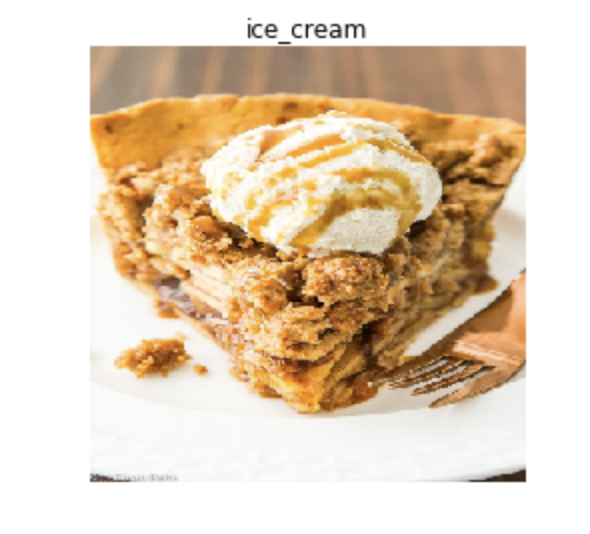
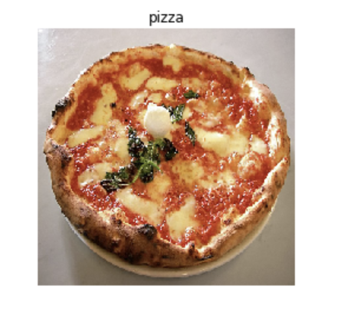
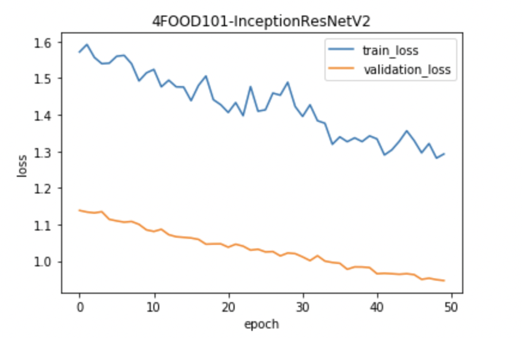
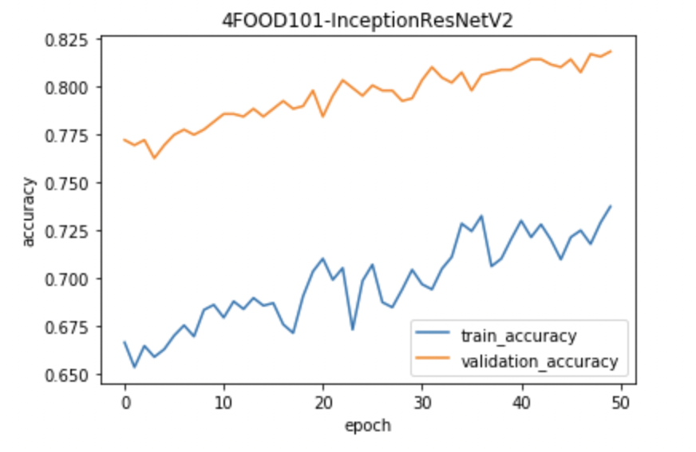

# Food Vision

Food Vision is an `End-to-End CNN Image Classification Model` which identifies the food in your image. 

It can identify over 100 different food classes

It is based upom a pre-trained Image Classification Model that comes with Keras and then retrained on the infamous **Food101 Dataset**.

**Accuracy :** **`85%`**

**Model 1:** **`EfficientNetB1`**

**Model 2:** **`Inception-ResNet-V2`**

**Dataset :** **`Food101`**

## [View Deployed Demo on Heroku](https://food-vision101.herokuapp.com/)
## [View Deployed Demo on Streamlit](https://share.streamlit.io/srajanseth84/all-ml-projects-streamlit/main/app.py)
- Just open above link and select Food Vision

## Demo


## Few Examples

* Ice-Cream predicted as Ice-Creame
  
* Pizza predicted as Pizza
  
## Run Locally

* Clone the project

```bash
  git clone https://github.com/srajanseth84/Food-Vision.git
```

* Go to the project directory

```bash
  cd Food-Vision
```
* Create venv

```bash
  python3 -m virtualenv venv 
```

* Activate the venv

```bash
  source venv/bin/activate
```

* Install dependencies

```bash
  pip install -r requirements.txt
```

* Start the server

```bash
  streamlit run app.py 
```

## All Food Classes (101)


## EFFICIENT-NET MODEL DESCRIPTION

- EfficientNet is a convolutional neural network architecture and scaling method that uniformly scales all dimensions of depth/width/resolution using a compound coefficient. Unlike conventional practice that arbitrary scales these factors, the EfficientNet scaling method uniformly scales network width, depth, and resolution with a set of fixed scaling coefficients.

- The compound scaling method is justified by the intuition that if the input image is bigger, then the network needs more layers to increase the receptive field and more channels to capture more fine-grained patterns on the bigger image.

- The base EfficientNet-B0 network is based on the inverted bottleneck residual blocks of MobileNetV2, in addition to squeeze-and-excitation blocks.

- EfficientNets also transfer well and achieve state-of-the-art accuracy on CIFAR-100 **(91.7%)**, Flowers **(98.8%)**, and 3 other transfer learning datasets, with an order of magnitude fewer parameters.

## Requirements (When building from Scratch)
### Data File

* [Food-101](http://data.vision.ee.ethz.ch/cvl/food-101.tar.gz)
(4.67GB)

### Dependencies

* [Tensorflow](https://github.com/tensorflow/tensorflow)
* [Tensorflow-Hub](https://github.com/tensorflow/hub)
* [Numpy](https://github.com/numpy/numpy)
* [Matplotlib](https://github.com/matplotlib/matplotlib)
* [Streamlit](https://streamlit.io/)
* [Model-1-Inception-Resnet-V2](https://www.tensorflow.org/api_docs/python/tf/keras/applications/inception_resnet_v2/InceptionResNetV2)
* [Model-2-EfficientNet(Used internally)](https://www.tensorflow.org/api_docs/python/tf/keras/applications/efficientnet/EfficientNetB1)

### Trained Model (Inception-Resnet-V2)

* [Download Link](https://drive.google.com/file/d/1oYT2Kcy8mNOyCOyJq5b6maZ9g84WcCf1/view?usp=sharing) (400+ MB)
* Above model all layers


* Training And Validation loss
 
  

* Training And Validation Accuracy

  

## Tech Stack
* **Front-End**: [Streamlit](https://github.com/streamlit/streamlit)
* **Cloud**: [Heroku](https://www.heroku.com/), [Streamlit Cloud](https://streamlit.io/cloud)
* **DL-Framework**: [Tensorflow](https://github.com/tensorflow/tensorflow)

## Authors

- [@srajanseth84](https://github.com/srajanseth84)
